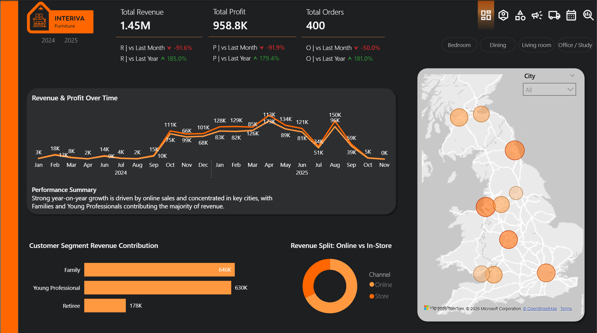
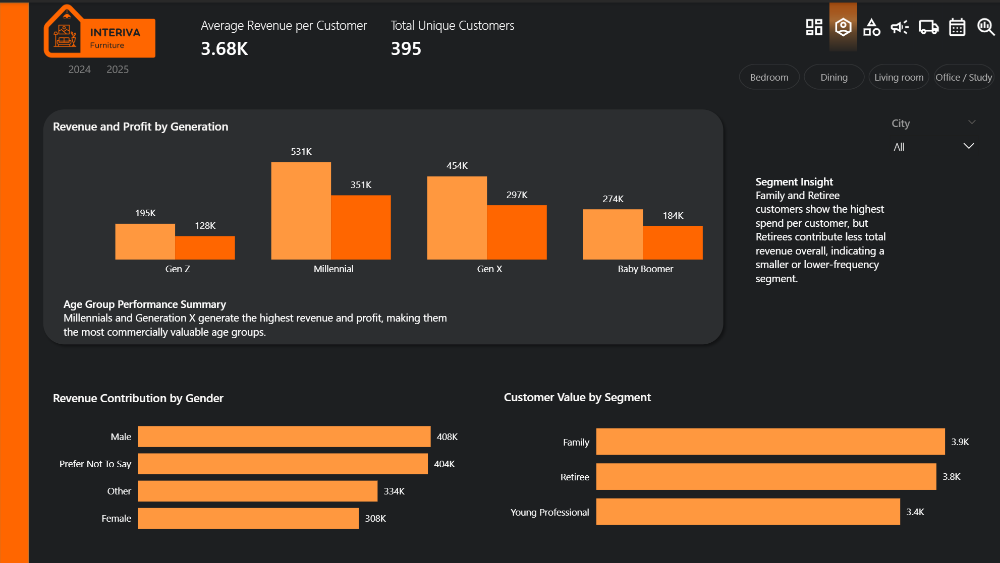
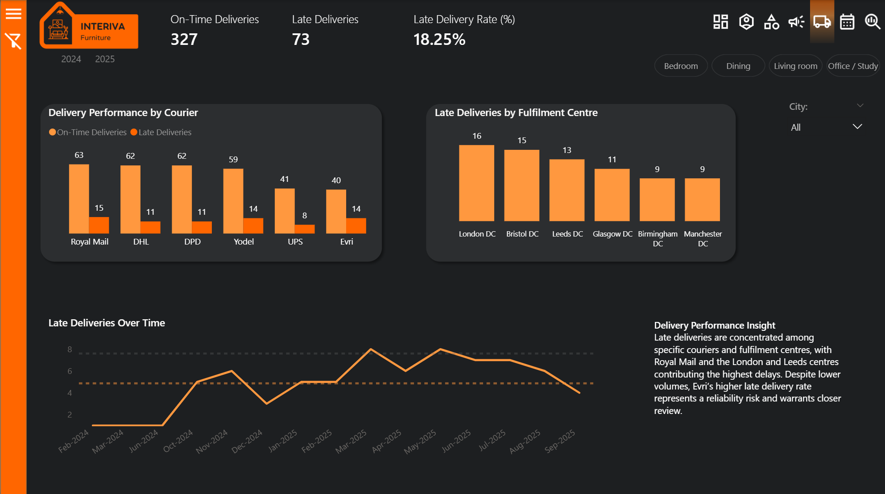
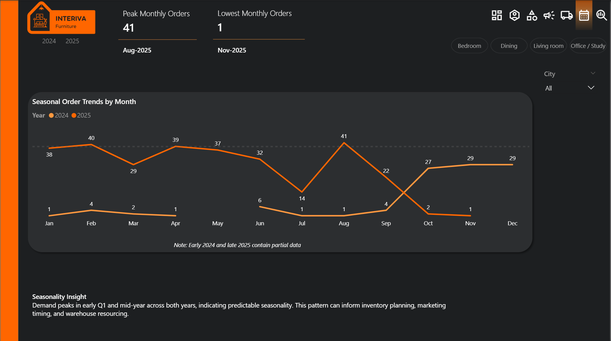
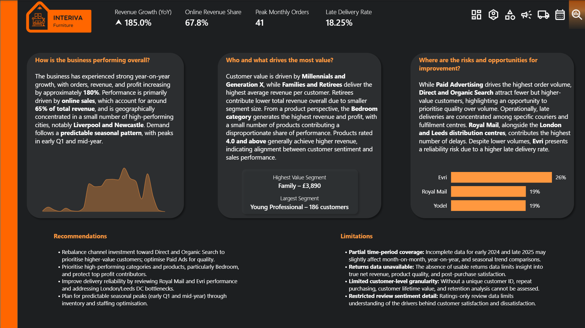

<h2>🪑 Interiva Furniture — Executive Performance Dashboard</h2>

<h3>Power BI | Data Analytics Portfolio Project</h3>

<h3>📌 Project Overview</h3>

This project presents an end-to-end analytics and Power BI reporting solution for a fictional UK furniture retailer, <strong>Interiva Furniture</strong>.
Over a two-year period (2024–2025), the business achieved ~<strong>180% year-on-year growth</strong>, but performance is uneven across customers, products, channels, and operations. 
The report is designed to help stakeholders quickly understand what is driving growth, where value is concentrated, and where operational risks may be limiting performance. :contentReference[oaicite:0]{index=0}

---

<h3>🎯 Project Objectives</h3>

<ul>
  <li>Provide an executive snapshot of revenue, profit, and order performance</li>
  <li>Identify where growth is coming from (channels, cities, seasonality)</li>
  <li>Understand which customer and product segments contribute the most value</li>
  <li>Assess marketing efficiency (volume vs value by source/channel)</li>
  <li>Evaluate delivery performance and highlight reliability risks</li>
  <li>Demonstrate strong Power BI modelling, DAX, and storytelling skills</li>
</ul>

---

<h3>❓ Business Questions Answered</h3>

<ul>
  <li><strong>Q1:</strong> How is the business performing overall (growth, channel mix, geographic concentration, seasonality)?</li>
  <li><strong>Q2:</strong> Who and what drives the most value (customer segments/generations, product categories, top contributors)?</li>
  <li><strong>Q3:</strong> Where are the risks and opportunities for improvement (marketing efficiency and delivery reliability)?</li>
</ul>

These questions structure the report narrative from executive overview → value drivers → optimisation opportunities. :contentReference[oaicite:1]{index=1}

---

<h3>🗂️ Data Model</h3>

The model uses a clean star-style layout anchored on <strong>fact_sales</strong>, supported by a dedicated <strong>dim_date</strong> table for time intelligence and <strong>dim_delivery</strong> for operational delivery analysis.
This structure enables consistent filtering, accurate aggregations, and scalable DAX measures across the report. :contentReference[oaicite:2]{index=2}

<h3>🧹 Data Preparation & Power Query Cleaning</h3> 
 All data used in this project was cleaned and prepared in <strong>Power Query</strong> to ensure consistency, reliability, and suitability for analysis before modelling and DAX development. 
 
 The cleaning process focused on standardising fields, resolving data quality issues, and shaping the dataset to support accurate aggregation and filtering across the report. 
 
<strong>Key steps included:</strong>
 <ul> <li>Removal of duplicate records and redundant columns</li> <li>Standardisation of text fields (capitalisation, trimming whitespace, consistent category naming)</li> <li>Data type enforcement across numeric, date, and categorical fields</li> <li>Creation of derived columns (e.g. customer name consolidation, profit calculation)</li> <li>Handling missing values, including replacing null ages with the dataset average where appropriate</li> <li>Separation of delivery-related attributes into a dedicated dimension table</li> </ul> 
 These steps ensured the final dataset was <strong>analysis-ready</strong>, reduced ambiguity in the data model, and enabled reliable KPI, trend, and segmentation analysis within Power BI. 
  
<em>Example Power Query transformation steps used to clean and prepare the dataset</em>

---

<h3>📊 Dashboard Structure & Narrative Flow</h3>

<h4>Page 1 — Overview</h4>

<strong>Purpose:</strong> 
Provide an executive snapshot of revenue, profit, orders, growth context, and where performance is concentrated.

<ul>
  <li>KPI cards with YoY and MoM comparisons</li>
  <li>Revenue & profit trend over time</li>
  <li>Revenue split: Online vs Store</li>
  <li>City-level performance map with drillable filters</li>
  <li>Customer segment contribution summary</li>
</ul>

---

<h4>Page 2 — Customers</h4>

<strong>Purpose:</strong> 
Understand customer value across generations, segments, and genders to inform targeting and retention strategy.

<ul>
  <li>Revenue & profit by generation</li>
  <li>Revenue contribution by gender</li>
  <li>Customer value by segment (avg revenue per customer)</li>
  <li>Unique customers KPI and segmentation insight callouts</li>
</ul>

---

<h4>Page 3 — Products</h4>

<strong>Purpose:</strong> 
Identify which categories/products drive performance and assess whether customer ratings align with commercial outcomes.

<ul>
  <li>Revenue concentration by category (treemap)</li>
  <li>Profit contribution by category</li>
  <li>Product rating vs revenue performance scatter</li>
  <li>Insight panel translating patterns into business meaning</li>
</ul>

---

<h4>Page 4 — Channels & Sources</h4>

<strong>Purpose:</strong> 
Compare marketing and sales sources by <strong>volume vs value</strong> to highlight efficiency opportunities.

<ul>
  <li>Total orders by source</li>
  <li>Efficiency scatter: total orders vs avg revenue per order</li>
  <li>Orders by payment method and device</li>
  <li>Optional drill-down by Online vs Store to separate channel dynamics</li>
</ul>

---

<h4>Page 5 — Delivery Performance</h4>

<strong>Purpose:</strong> 
Surface operational risk and reliability issues by courier and fulfilment centre.

<ul>
  <li>On-time vs late deliveries KPI set</li>
  <li>Late deliveries by courier and fulfilment centre</li>
  <li>Late deliveries trend over time</li>
  <li>Filters to isolate courier/warehouse combinations for investigation</li>
</ul>

---

<h4>Page 6 — Seasonality</h4>

<strong>Purpose:</strong> 
Confirm repeatable demand peaks across months/quarters to support planning (inventory, staffing, campaign timing).

<ul>
  <li>Peak and lowest monthly order identification</li>
  <li>Monthly trend comparison across years</li>
  <li>Context note for partial edge-of-period data</li>
</ul>

---

<h4>Page 7 — Insights & Recommendations</h4>

<strong>Purpose:</strong> 
Bring together the executive narrative: performance summary, value drivers, risks, recommendations, and limitations.

<ul>
  <li>3-panel story: Overall performance / Value drivers / Risks & opportunities</li>
  <li>Actionable recommendations linked directly to the findings</li>
  <li>Clear limitations section to demonstrate analytical rigour</li>
</ul>

---

<h3>🔍 Key Insights Discovered</h3>

<strong>Growth & concentration:</strong>

<ul>
  <li>Revenue, profit, and orders grew by roughly <strong>~180% YoY</strong> across the period. :contentReference[oaicite:3]{index=3}</li>
  <li>Growth is driven primarily by <strong>online sales</strong> (around two-thirds of revenue). :contentReference[oaicite:4]{index=4}</li>
  <li>Performance is geographically concentrated in a small number of high-performing cities (notably <strong>Liverpool</strong> and <strong>Newcastle</strong>). :contentReference[oaicite:5]{index=5}</li>
</ul>

<strong>Customer and product value:</strong>

<ul>
  <li><strong>Millennials</strong> and <strong>Generation X</strong> generate the highest total revenue/profit overall. :contentReference[oaicite:6]{index=6}</li>
  <li><strong>Families</strong> and <strong>Retirees</strong> show the highest average spend per customer, useful for pricing and loyalty strategies. :contentReference[oaicite:7]{index=7}</li>
  <li>The <strong>Bedroom</strong> category dominates revenue and profit, with a small set of products contributing disproportionately to both. :contentReference[oaicite:8]{index=8}</li>
</ul>

<strong>Efficiency & operational risk:</strong>

<ul>
  <li><strong>Paid Ads</strong> drive the highest order volume but lower average revenue per order; <strong>Direct</strong> and <strong>Organic Search</strong> bring fewer but higher-value orders. :contentReference[oaicite:9]{index=9}</li>
  <li>Late deliveries are concentrated across specific couriers and fulfilment centres; <strong>Royal Mail</strong> and the <strong>London/Leeds</strong> centres contribute the most delays, while <strong>Evri</strong> shows a reliability risk despite lower volume. :contentReference[oaicite:10]{index=10}</li>
</ul>

---

<h3>📌 Recommendations</h3>

<ul>
  <li><strong>Rebalance channel investment</strong> toward higher-value Direct and Organic traffic; optimise Paid Ads for quality, not just volume.</li>
  <li><strong>Protect and scale top-performing Bedroom products</strong> (availability, merchandising, cross-sell bundles), since category performance is highly concentrated.</li>
  <li><strong>Improve delivery reliability</strong> by reviewing Royal Mail and Evri performance and investigating London/Leeds distribution bottlenecks.</li>
  <li><strong>Plan for seasonal peaks</strong> (early Q1 and mid-year) through inventory planning, staffing, and timed promotions. :contentReference[oaicite:11]{index=11}</li>
</ul>

---

<h3>⚠️ Limitations</h3>

<ul>
  <li><strong>Partial time-period coverage:</strong> early 2024 and late 2025 include incomplete data, which may affect edge-of-period comparisons. :contentReference[oaicite:12]{index=12}</li>
  <li><strong>Returns data unavailable:</strong> limits insight into product quality issues, true net revenue, and post-purchase satisfaction. :contentReference[oaicite:13]{index=13}</li>
  <li><strong>No unique customer ID:</strong> restricts deeper customer behaviour analysis (repeat purchasing, retention, lifetime value). :contentReference[oaicite:14]{index=14}</li>
  <li><strong>Ratings-only sentiment:</strong> review data is limited to star ratings, so drivers of satisfaction/dissatisfaction can’t be fully explained. :contentReference[oaicite:15]{index=15}</li>
</ul>

---

<h3>🛠 Tools & Skills Demonstrated</h3>

<ul>
  <li><strong>Power BI:</strong> interactive dashboards, slicers, drill-down filtering, KPI design, executive reporting</li>
  <li><strong>Power Query:</strong> data cleaning, type handling, standardisation, and transformation workflow</li>
  <li><strong>Data Modelling:</strong> star-style model with a dedicated date table for time intelligence</li>
  <li><strong>DAX:</strong> KPIs, YoY/MoM trends, share-of-total metrics, segmentation measures, operational rates</li>
  <li><strong>Analytics & Storytelling:</strong> value vs volume framing, concentration analysis, risk/opportunity mapping</li>
  <li><strong>Visual Design:</strong> consistent theme, hierarchy, and insight callouts to support decision-making</li>
</ul>

---

<h3>📁 Repository Structure</h3>

<ul>
  <li><strong>/dashboard</strong> — report page screenshots (Overview, Customers, Products, Channels, Delivery, Seasonality, Insights)</li>
  <li><strong>/data</strong> — raw and cleaned CSV files used in the project</li>
  <li><strong>/docs</strong> — project brief and supporting documentation</li>
  <li><strong>/powerquery</strong> — Power Query transformation steps / cleaning notes</li>
  <li><strong>/dax</strong> — measures and calculations used in the report</li>
  <li><strong>Data_Model.png</strong> — model screenshot</li>
</ul>

---

<em>
Project created by Sean Worrall as part of a Level 3 Data Analytics assessment to demonstrate business-focused reporting and decision-support using Power BI. 
</em>

