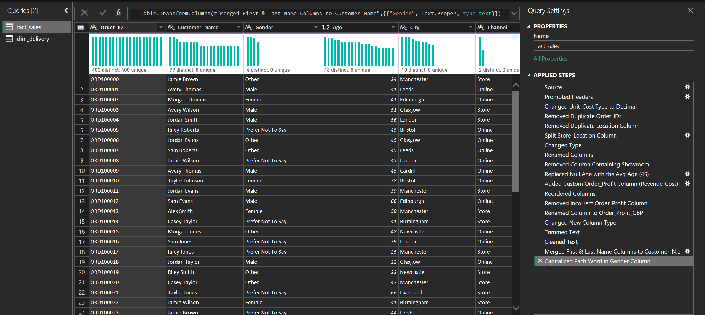

<h2>🧹 Power Query Data Preparation</h2>

<h3>Data Cleaning & Transformation Workflow</h3>

This folder documents the <strong>Power Query</strong> steps used to prepare the raw dataset before modelling and analysis in Power BI.

Power Query was primarily used to clean and standardise the <strong>fact_sales</strong> table, ensuring the data was analysis-ready before DAX measures and report visuals were created.

---

<h3>🔧 Cleaning Steps Applied</h3>

<strong>fact_sales</strong>

<ul>
  <li>Removal of duplicate order records</li>
  <li>Removal of redundant and unused columns</li>
  <li>Standardisation of text fields (capitalisation, trimming whitespace, consistent labels)</li>
  <li>Explicit data type assignment across numeric, date, and categorical fields</li>
  <li>Handling missing values, including replacement of null ages with the dataset average where appropriate</li>
  <li>Creation of derived columns (e.g., consolidated customer name, order profit)</li>
</ul>

These steps ensured accurate aggregation, consistent filtering, and reliable KPI calculations throughout the report.

---

<h3>🧩 Query Structure</h3>

<ul>
  <li>
    <strong>fact_sales</strong> — cleaned transactional dataset containing orders, revenue, profit, customer, and channel attributes
  </li>
  <li>
    <strong>dim_delivery</strong> — supporting delivery dataset, renamed for clarity and used without further transformation
  </li>
</ul>

A dedicated <strong>dim_date</strong> table was generated later in Power BI using <strong>DAX</strong> to support time intelligence and trend analysis, rather than being created in Power Query.

---

<h3>🖼 Example Power Query Transformations</h3>

The screenshot below shows representative transformation steps applied to the <strong>fact_sales</strong> table within Power Query.

<em>Power Query applied steps for the fact_sales table</em>

---

<em>
This approach reflects a real-world workflow where Power Query is used for data preparation and standardisation, while modelling and time-based logic are handled within Power BI using DAX.
</em>

